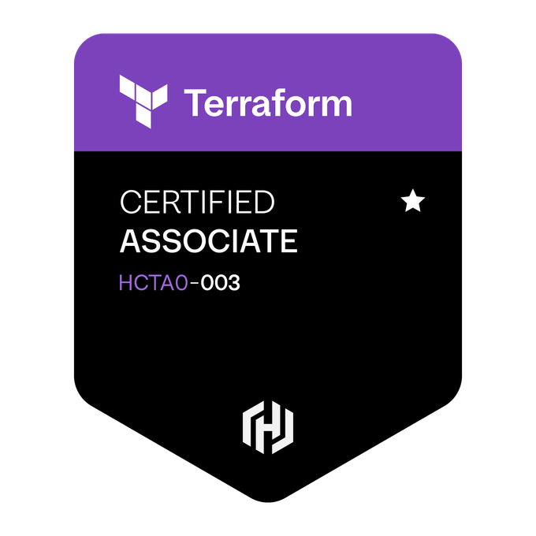

  
  <b>All my configs are flakey, but reproducibly so</b>
  

<h1>Certs<h1/>
<table>
  <tr>
    <td align="center">
       
      <b>CKA</b> 21.10.2024
    </td>
    <td align="center">
       
      <b>KCNA</b> 25.02.2025
    </td>
    <td align="center">
       
      <b>LFCS</b> 21.08.2023
    </td>
    <td align="center">
       
      <b>Terraform Associate (003)</b> 13.10.2025
    </td>
  </tr>
</table>

<h1>Most Used Languages<h1/>

  

